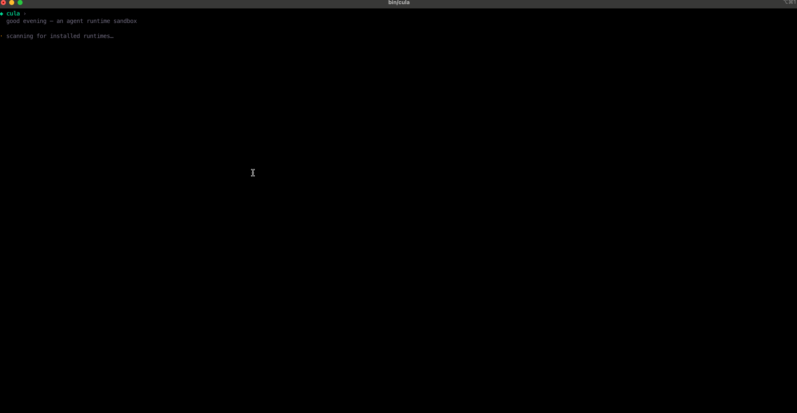

# cula — Connect Your Local Agents

A Go library and TUI that bridges local coding agents — **Claude Code**, **Codex**, **OpenCode**, and more — behind one uniform interface.

Use it to talk to whichever agent the user has installed without writing per-CLI glue, or to build services (multica-, slock.ai-style routers) that forward requests to the agent running on the user's machine.

## Why cula

- **One API, many agents.** Spawn a session, stream events, cancel — the same code works across every supported runtime.
- **Normalized event stream.** Each runtime's native output is mapped to a common `Event` type (`text`, `tool_call`, `tool_result`, `activity`, `state`, …) so downstream consumers don't care which CLI produced it.
- **Local-first.** Sessions run as subprocesses against the user's already-authenticated CLI. No new credentials, no extra inference cost.
- **Detection built in.** Discover which runtimes are installed, their versions, auth status, and available models before you spawn anything.
- **Composable.** Use the `pkg` library headlessly to build your own routers, daemons, or HTTP bridges. Use the bundled TUI when you want an interactive UI for free.

## Demo



The bundled `cula` TUI is a reference example, not the product. It exists to show how the library wires multiple agents into a single UI:

- **Detect** which runtimes are installed and pick one (Claude Code / Codex / OpenCode) from a single picker.
- **Configure** the working directory and model, then **spawn** a session through the same `Registry` regardless of which CLI backs it.
- **Render** the normalized event stream — assistant text, reasoning, tool calls, activity, and state transitions — in one consistent chat view, so every runtime looks and behaves the same.

If you want a chat UI over local agents, use it as-is. If you're building something else (router, daemon, IDE plugin), treat it as a worked example of how to consume `pkg` and adapt the same pattern to your surface.

## Install

```bash
go install github.com/git-hulk/cula/cmd/cula@latest
```

Or build from source:

```bash
git clone https://github.com/git-hulk/cula
cd cula && make build
./bin/cula
```

## Library usage

```go
import (
    cula "github.com/git-hulk/cula/pkg"
    "github.com/git-hulk/cula/internal/runtime/claudecode"
    "github.com/git-hulk/cula/internal/runtime/codex"
    "github.com/git-hulk/cula/internal/runtime/opencode"
)

reg := cula.NewRegistry(
    claudecode.New(cula.Config{}),
    codex.New(cula.Config{}),
    opencode.New(cula.Config{}),
)

session, err := reg.SpawnSession(ctx, cula.SessionInput{
    Runtime:    cula.RuntimeClaudeCode,
    Prompt:     "summarize this repo",
    WorkingDir: "/path/to/project",
})
if err != nil { /* ... */ }

for ev := range session.Events() {
    switch ev.Type {
    case cula.EventText:
        fmt.Print(ev.Text)
    case cula.EventToolCall:
        // ...
    }
}
```

## Supported runtimes

| Runtime | Kind |
| --- | --- |
| Claude Code | `claude-code` |
| Codex | `codex` |
| OpenCode | `opencode` |

Adding a new runtime means implementing the `Runtime` interface in `pkg/runtime.go` and registering it.

## Build a service on top

cula is the agent-bridge layer — it doesn't ship a server. Drop it into your own HTTP/gRPC service and forward incoming requests to a local session:

```
client ──▶ your service ──▶ cula.Registry ──▶ local agent CLI
                                  ▲
                              streamed Events
```

That's the same shape multica and slock.ai-style products use to expose local agents over the network.

## License

See [LICENSE](LICENSE).
